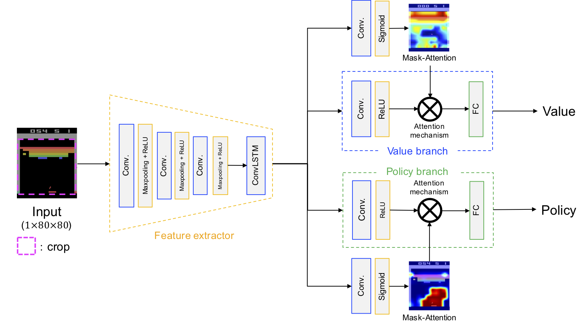
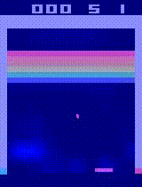
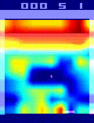
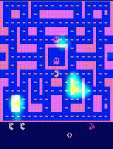
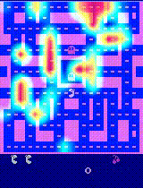
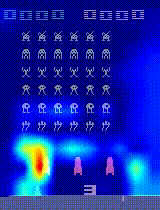
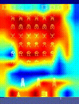

# Mask-Attention A3C
Writer: Hidenori Itaya

This is the code for Mask-Attention A3C.



     

## Requirements
- Python 3.6.8
- pytorch 1.3.1
- gym 0.15.4
- numpy 1.16.2
- opencv 4.0
- tqdm 4.31.1

## Training
```
python main.py --env <ENV_NAME> --max_global_step <STEP> <NET_FLAG> --workers <W_NUM> --gpu-ids <GPU_ID>
```
- `<ENV_NAME>`: Name of the environment.

- `<STEP>`: Maximum number of steps for training.

- `<NET_FLAG>`
  - `--convlstm`: Whether to use Convolutional LSTM.
  - `--mask_single_p`: Introduce attention mechanism to policy branch. (Policy Mask A3c)
  - `--mask_single_v`: Introduce attention mechanism to value branch. (Value Mask A3C)
  - `--mask_double`: Introduce attention mechanism to policy & value branch. (Mask A3C)
  - If you don't specify anything, vanilla A3C will work.

- `<W_NUM>`: Number of training processes to use.

- `<GPU_ID>`: Specify the id of the gpu to use.

To train agent (1.0*10<sup>7</sup>step) in PongNoFrameskip-v4 environment with 5 different worker processes on 2 GPUs (The network structure is Mask A3C using ConvLSTM):
```
python main.py --env PongNoFrameskip-v4 --max_global_step 10000000 --convlstm --mask-double --workers 5 --gpu-ids 0 1
```

or

```
sh ./start_train.sh
```

## Evaluation of trained model & Visualization of mask-attention

```
python gym_eval.py --env <ENV_NAME> <NET_FLAG> --load-model <MODEL_NAME> --num-episodes <EPI_NUM> <VIS_IMG> --gpu-ids <GPU_ID>
```

- `<ENV_NAME>`: Name of the environment.

- `<NET_FLAG>`
  - `--convlstm`: Whether to use Convolutional LSTM.
  - `--mask_single_p`: Introduce attention mechanism to policy branch. (Policy Mask A3c)
  - `--mask_single_v`: Introduce attention mechanism to value branch.  (Value Mask A3c)
  - `--mask_double`: Introduce attention mechanism to policy & value branch. (Mask A3c)
  - If you don't specify anything, vanilla A3C will work.

- `<MODEL_NAME>`: Path to trained model.
  
- `<EPI_NUM>`: Number of episodes.

- `<VIS_IMG>`
  - `--image`: Whether to visualize mask-attention.

- `<GPU_ID>`: Specify the id of the gpu to use.

To run a 100 episode gym evaluation using PongNoFrameskip-v4 with trained model (The network structure is Mask A3C using ConvLSTM):

```
python gym_eval.py --convlstm --mask_double --env PongNoFrameskip-v4 --load-model <MODEL_NAME> --num-episodes 100
```

or

```
sh ./start_eval.sh
```
